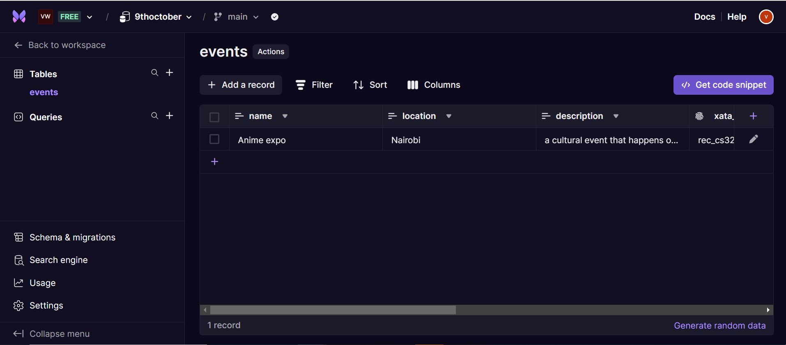
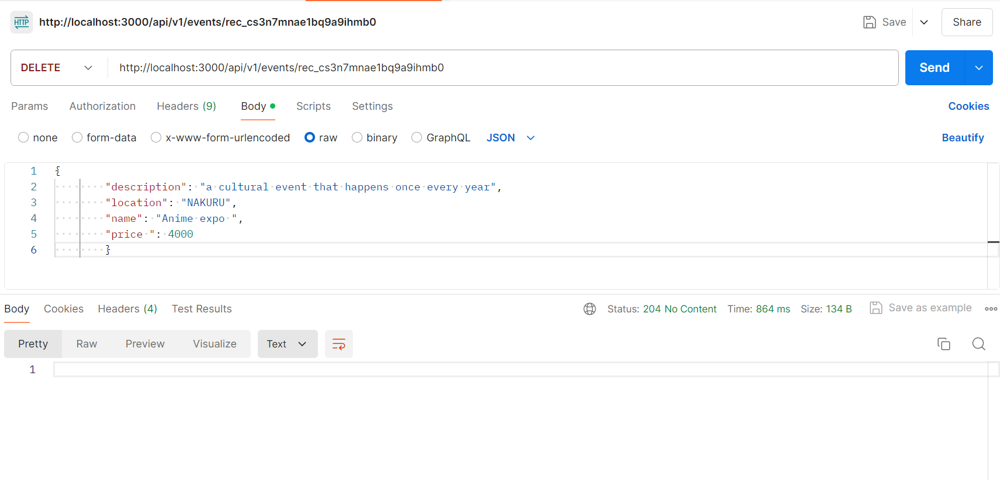

# Project Name

A brief description of your project, its purpose, and what it does.

## Table of Contents

- [Features](#features)
- [Installation](#installation)
- [Usage](#usage)
- [API Endpoints](#api-endpoints)
- [Screenshots](#screenshots)
- [Contributing](#contributing)
- [License](#license)

## Features

- Added event management functionality
- Implemented input validation using Joi
- Enhanced error handling
- Created a RESTful API with CRUD operations for events
- Integrated Xata as a database solution

## Installation

To set up the project locally, follow these steps:

1. Clone the repository:

   git clone https://github.com/vinnie0987/Javascript

Navigate to the project directory:

cd XATAPROJ2

Install the dependencies:

npm install   

Create a .env file in the root of your project and add necessary configurations.

Start the server:

npm start

Usage

You can use the API endpoints to manage events. The server will be running on http://localhost:3000, and you can access the API through the specified routes.

GET /api/v1/events - Fetch all events
GET /api/v1/events/:id - Fetch a single event by ID
POST /api/v1/events - Create a new event
PUT /api/v1/events/:id - Update an existing event by ID
DELETE /api/v1/events/:id - Delete an event by ID

Screenshots

This is a compilation of all the images from the using xata database assignment.    
This is my xata database and table

   

Below is a screenshot of a sample delete request.

Contributing
Contributions are welcome! This project utilizes several key libraries that play a significant role in its functionality:

Express: A web application framework for Node.js to build APIs.
Joi: A powerful schema description language and data validator for JavaScript.
Xata: A serverless database solution for managing data easily.
Dotenv: A zero-dependency module that loads environment variables from a .env file.
